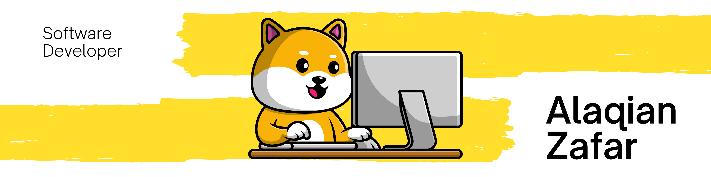

  

<h1>Hi 👋, I'm Alaqian Zafar</h1>
<h2>A passionate software developer from NYU</h2>

- 😄 Pronouns: **He/Him/His**
- 🌱 I’m currently learning **Synthetic Image Generation Using Stable Diffusion**

- 👯 I’m looking to collaborate on [Building a Rubik's Cube Solver using Reinforcement Learning](https://github.com/Alaqian/rubicks-cube)

- 💬 Ask me about **Computer Vision and Medical Imaging**

- 📫 How to reach me: **aaz7118@nyu.edu**

- ⚡ Fun fact **I love solving Jigsaw Puzzles** 🧩

<h2 align="left">Connect with me</h2>

<h2 align="left">Languages and Tools</h2>

<h3 align="left">Programming Languages</h3>

    
    
    
    
    

<h3 align="left">Artificial Intelligence and Machine Learning</h3>

    
    
    
    
    
    

<h3 align="left">Big Data and Analytics</h3>

    
    
    
    
    
    

<h3 align="left">Cloud Services</h3>

    
    

<h3 align="left">DataBase</h3>

    
    

<h3 align="left">Software and Tools</h3>

    
    
    
    
    

<h3 align="left">Operating Systems</h3>

    
    
    

<h3 align="left">Frontend Development</h3>

    
    

<h3 align="left">Backend Development</h3>

    

<!--h3 align="left">Other: </h3-->
<!-- Add content for the "Other" section here -->

